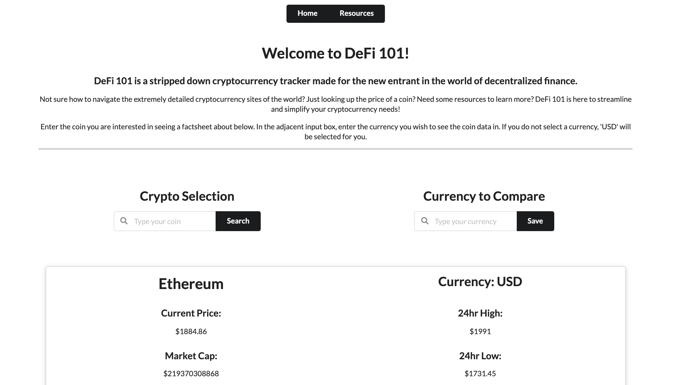
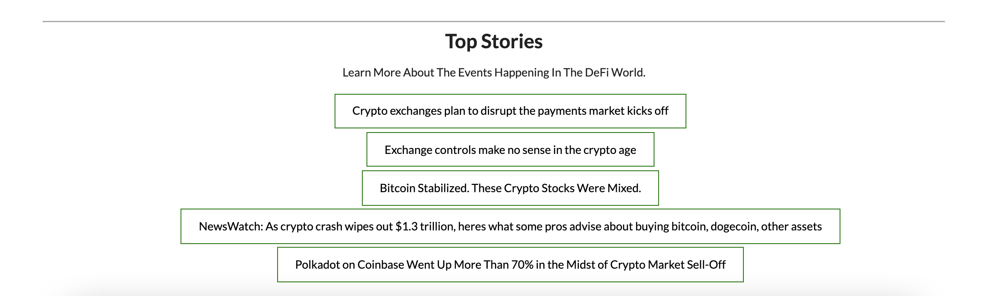
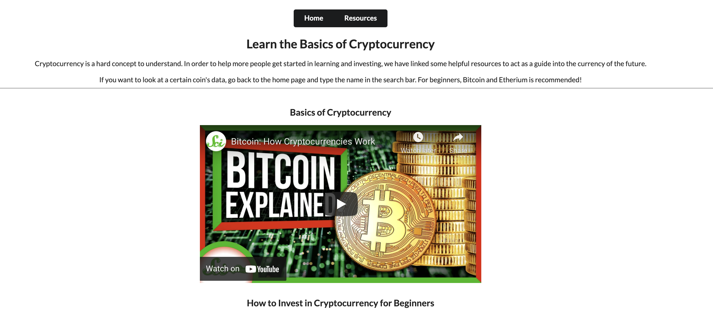

# DeFi 101

## Description
- DeFi 101 is a simple application that allows the user to check prices and high-level market data of the coin of their choice. 
- Lots of applications are highly complicated and involved, DeFi 101 aims to simplify the entry to cryptocurrency by providing high-level 
data and educational resources.

## How To Use
- Select a currency to compare the coin data against (if you do not select on, USD will be selected for you).
- Type in the Cryptocurrency of your choice (or select from the dropdown).
- Coin data will populate underneath the search bars. 
- If you want to search for something else, just re-search something in the search bar. 
- To get to the resources page, simply click the "Resources" navigation button and you will be taken there. 

## Link To Deployed Application
https://radams017.github.io/CryptoCoin-Tracker/

## Screenshot

## License
MIT
